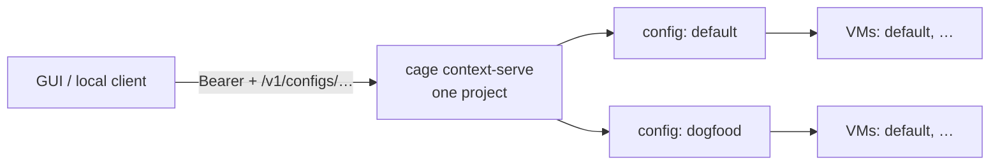

# Client context API

Host-only HTTP API for GUI and local clients. One `context-serve` process owns
**one project**. It may expose several allowlisted configs in that repo and
named VMs under each config.

Clients that want multiple projects talk to multiple serves. They never send
project paths, extra config files, or backend VM selectors.

Bind is loopback-only (`127.0.0.1` / `::1` / `localhost`), default ephemeral
port. Serve generates a bearer token, writes addr/token/pid to `.cage/serve.json`,
and prints `http://127.0.0.1:<port>/?token=…` for a launcher to open.



## Start

```bash
cage context-serve [--project .] [--config .cage/cage.yaml]
```

`--config` may be repeated. With none, serve uses the usual resolve path (one
`cage*.yaml`, or pass `--config` when there are several). `--token` overrides
the generated secret. `--allowed-host` (repeatable) restricts the HTTP `Host`
header; omit it for no Host check. Names are written to `.cage/serve.json`.
Command is hidden; intended for host tooling.

## Auth

`Authorization: Bearer <token>`

Token is generated at start (or `--token`). Native clients read `.cage/serve.json`.
A launcher opens the printed URL so a local web client can take `?token=` and
send it as Bearer on later calls. Do not keep the token in the query on API
requests.

Missing or invalid token → `401`. Loopback bearer auth is not a multi-user ACL.

## Routes

| Method | Path                                                                  | Notes                                         |
| ------ | --------------------------------------------------------------------- | --------------------------------------------- |
| `GET`  | `/v1/configs`                                                         | Allowlisted config aliases this token may see |
| `GET`  | `/v1/configs/{config}/vms`                                            | Known VMs + lifecycle state                   |
| `POST` | `/v1/configs/{config}/vms/{vm}/start`                                 | Create+start from that config                 |
| `POST` | `/v1/configs/{config}/vms/{vm}/stop`                                  | Stop                                          |
| `POST` | `/v1/configs/{config}/vms/{vm}/delete`                                | Delete                                        |
| `POST` | `/v1/configs/{config}/vms/{vm}/context/{context}/plugins/{seat}/call` | Generic plugin call                           |

`config` is a server-owned alias (`cage.yaml` → `default`, `cage.dogfood.yaml`
→ `dogfood`). `vm` is the human instance ID (`default` when omitted on the CLI).

- Unknown config, context, seat, or non-callable seat → `404`
- Invalid VM id → `400`
- Unavailable configured plugin → `503`

### List VMs

Always includes `default`. VMs started via the API are remembered. `state` comes
from the runtime backend when possible; otherwise `absent` / `unknown`.

### Plugin call body

```json
{ "operation": "do", "payload": {} }
```

Response: `{"payload": ...}`. Only seats with manifest `client: true` are started
and callable. Default secrets seats stay unstarted.

Resolved contexts may include safe VM metadata (`instanceID`, `backendVMID`).
They never include host secrets or arbitrary client-selected paths.

## Limits

- Max request / response body size (defaults 1 MiB / 4 MiB)
- Concurrent call limit
- Rate limit keyed by identity + config + VM
