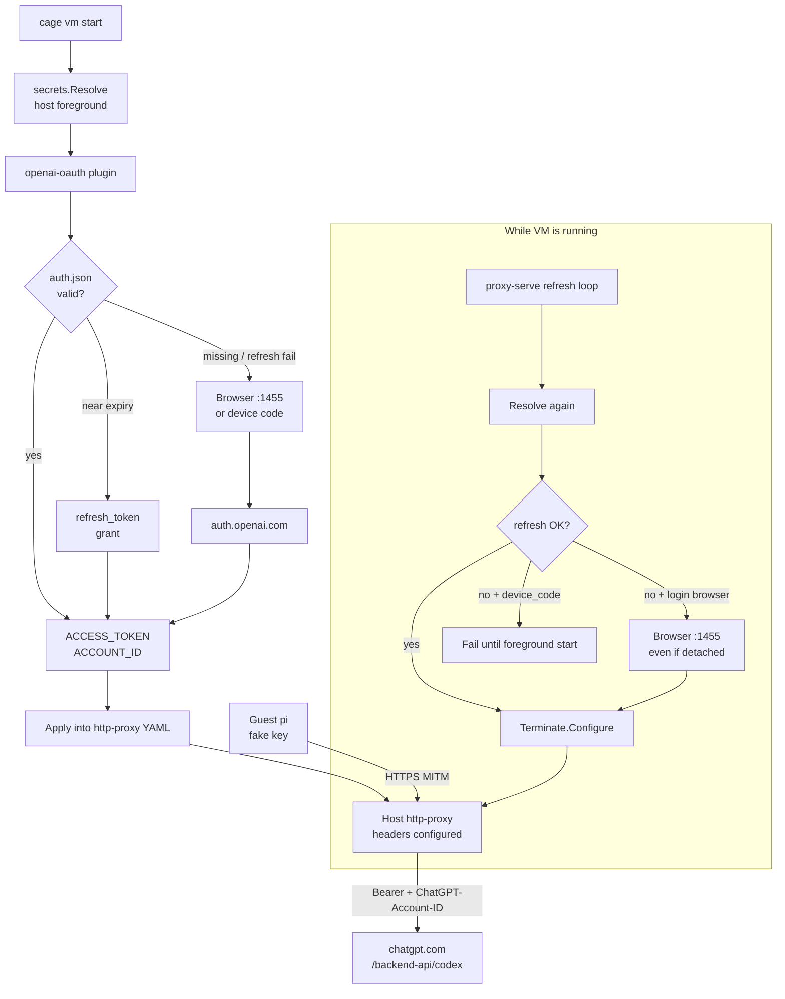

# OpenAI OAuth (`secrets.plugins`)

Host-side ChatGPT/Codex subscription auth for http-proxy inject. Uses the same
public Codex OAuth client as Codex CLI / pi.

Tokens stay on the host. The guest keeps a placeholder key; MITM replaces
`Authorization` and sets `ChatGPT-Account-ID`.

## Install

```bash
cage plugin install -l ./plugins/secrets/openai-oauth
```

## Shape

```yaml
secrets:
  plugins:
    openai-oauth:
      # path: ~/.cage/secrets/openai-oauth/auth.json   # default
      # login: browser | device_code                  # default browser
      vars:
        ACCESS_TOKEN: access_token
        ACCOUNT_ID: account_id

network:
  plugins:
    http-proxy:
      openai:
        url: https://chatgpt.com/backend-api/codex
        headers:
          Authorization: "Bearer {{ secrets.openai-oauth.ACCESS_TOKEN }}"
          ChatGPT-Account-ID: "{{ secrets.openai-oauth.ACCOUNT_ID }}"
          OpenAI-Beta: "responses=v1"
```

Auth file is Codex-compatible JSON — you can point `path` at `~/.codex/auth.json`
if you already use Codex CLI.

## Flow




## Token Refresh

- At start, Cage resolves secrets once (interactive login allowed).

While the proxy runs, it periodically re-resolves templates and re-Configures
http-proxy (`secrets.refresh_interval`, default `2m`). `openai-oauth` refreshes
the access token from the stored refresh token when it is within the 5-minute
expiry skew. Detached proxy sets `CAGE_SECRETS_INTERACTIVE=0`: silent refresh
still runs; if refresh fails and `login: browser` (default), the proxy opens the
browser callback again. With `login: device_code`, re-login stays foreground-only
(`cage vm start`) — there is nowhere to show the code.

## Guest (pi)

Use provider `openai-codex`, not `openai` pointed at the Codex URL.


| Wrong                                               | Right                                            |
| --------------------------------------------------- | ------------------------------------------------ |
| `providers.openai` + `baseUrl: …/backend-api/codex` | `providers.openai-codex` (built-in models / API) |


Pi’s Platform `openai-responses` client sends fields Codex rejects (`max_output_tokens`, `prompt_cache_retention`, …). The OpenAI SDK often surfaces that as `400 status code (no body)`.

`openai-codex` needs a JWT-shaped `apiKey` so it can read `chatgpt_account_id` before the request. A placeholder JWT is enough — MITM still replaces `Authorization` and `ChatGPT-Account-ID`.

```json
{
  "providers": {
    "openai-codex": {
      "apiKey": "eyJhbGciOiJub25lIiwidHlwIjoiSldUIn0.eyJodHRwczovL2FwaS5vcGVuYWkuY29tL2F1dGgiOnsiY2hhdGdwdF9hY2NvdW50X2lkIjoiY2FnZS1wbGFjZWhvbGRlciJ9fQ.cage"
    }
  }
}
```

```json
{ "defaultProvider": "openai-codex", "defaultModel": "gpt-5.6-luna" }
```

See `.cage/plugins/runtime/pi-agent/` (synced into the guest on start).

## Notes

- Never exports `refresh_token` through vars.
- Upstream is the Codex ChatGPT backend, not Platform `api.openai.com` API keys.
- First login needs a local browser (port 1455) or `login: device_code` for headless.

